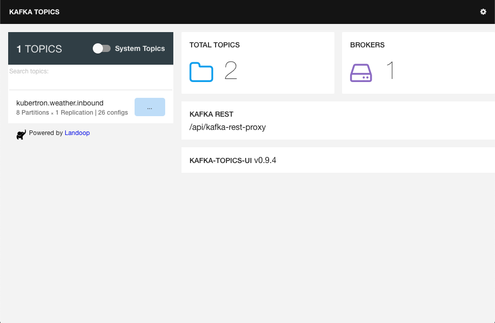

# Getting Started 

## Some background
Kafka is a distributed messaging system that's fast and highly scalable. It
provides messaging through a publish and subscribe model. 

``` sidebar:: You are free, and that is why you are lost.

    Franz Kafka (3 July 1883 – 3 June 1924) was a German-speaking Bohemian
    novelist and short-story writer, widely regarded as one of the major
    figures of 20th-century literature. His work fuses elements of realism and
    the fantastic.
```

Kafka was originally developed by LinkedIn. Jay Kreps (CEO of Confluent, and
formerly the lead architect for data infrastructure at LinkedIn) chose to
name the software after the author Franz Kafka because it is "a system
optimized for writing", and he liked Kafka's work.

Due to its distributed design, Kafka allows for a large number of permanent
or ad-hoc consumers and makes it highly available, resilient to node failures
and able to support automatic recovery. These characteristics make it an
ideal fit for communication and integration between components of large-scale
data systems.

## Prerequisites
To complete our work we will need to:

- Clone a git repository.
- Run docker containers.
- Run some python programs that we will write.

The following sections provide more details on these requirements.

### Terminal and Code Editor 
We will need to have a suitable terminal application where we can issue
various commands (e.g. start Kafka or run the apps). We will also need a code
editor to author our producer and consumer code.

### Git
Git is a version control system (VCS). We need it to clone the
[Kafka Demo](https://github.com/davecharles/kafka_demo) repository. If you
don't have `git` installed then
[this is a good place to start](https://git-scm.com/book/en/v2/Getting-Started-Installing-Git). 

### Docker
Docker provides the ability to package and run an application in a loosely
isolated environment called a *container*. If you don't have `docker` installed
then [this is a good place to start](https://docs.docker.com/engine/install/). 

### Python
Python is a general purpose, intuitive, high level programming language.
If you don't have `python` installed then
[this is a good place to start](https://docs.docker.com/engine/install/). A
suitable version is `Python 3.8`.

Python will also require some additional dependencies installed. These include:

```bash
kafka-python==2.0.1
termcolor==1.1.0
```

You should be able to install these using [pip](https://pip.pypa.io/en/stable/)
which is usually packaged with Python.

## Clone the repository
The [Kafka 101](https://github.com/davecharles/kafka_demo) repository is
required to get going. Open a terminal window and clone the repository as
follows:

```bash
$ git clone git@github.com:davecharles/kafka_demo.git
$ cd kafka_demo
```
## Take a look around
For the purposes of this 101 tutorial we are primarily interested in the
following project files and folders:

- `docker-compose.yaml`. Docker Compose is a tool for defining and running
multi-container Docker applications. This file tells Docker Compose how to
spin up the various components (Docker containers) required to get a basic
Kafka instance up and running.

- `Makefile`. The Makefile contains "build targets"; you use `make` commands
to perform certain actions within the project.

- `src` folder. This is where we'll put the Python code we write.

Right now, you don't need a detailed understanding of their content or how
they work, but it's useful to know what we are working with during this
tutorial. 

## Start up Kafka
Before we can _start_ kafka, we need to perform the "build" step. All the
container images are pre-built and already exist in an online container
registry (called "Docker Hub"), so the build is really just a case of caching
these locally. Invoke the build as follows: 

```bash
$ make compose-build
```

You will see something like:

```bash
docker-compose build
zookeeper uses an image, skipping
kafka uses an image, skipping
kafka-rest uses an image, skipping
kafka-topics-ui uses an image, skipping
```

OK, let's start Kafka:

```bash
$ make compose-up
```

As Docker Compose starts the various containers you will see something like:

```bash
docker-compose up -d
Creating network "kafka_demo_default" with the default driver
Creating kafka_demo_zookeeper_1 ... done
Creating kafka_demo_kafka_1     ... done
Creating kafka_demo_kafka-rest_1 ... done
Creating kafka_demo_kafka-topics-ui_1 ... done
```

You may have noticed a container started called `kafka_demo_kafka-topics-ui_1`.
This is the Kafka Topics UI and enables you to look at what's going on in
Kafka. Let's check Kafka is "up and running". 

Navigate a browser to `http://localhost:8000`. Initially it will look
pretty bare:



The UI shows two topics. There is one "system" topic and we've configured
kafka (through the `docker-compose.yaml` file) to automatically create a
topic called `kubertron.weather.inbound` that we will use later, but it is
currently empty. As expected, there is a single Kafka broker.

## The story so far
This went well, well done! He's a quick recap of what we have done so far:

- Discovered a bit of background on Kafka.
- Reviewed the prerequisites for this tutorial.
- We cloned the Kafka Demo github repository and reviewed some of the files
  and folders.
- We built, and started Kafka.
- We took a look at the Kafka UI.
 
Next we are going to write a simple Kafka Producer required by our "Weather
Data" app using Python.  
