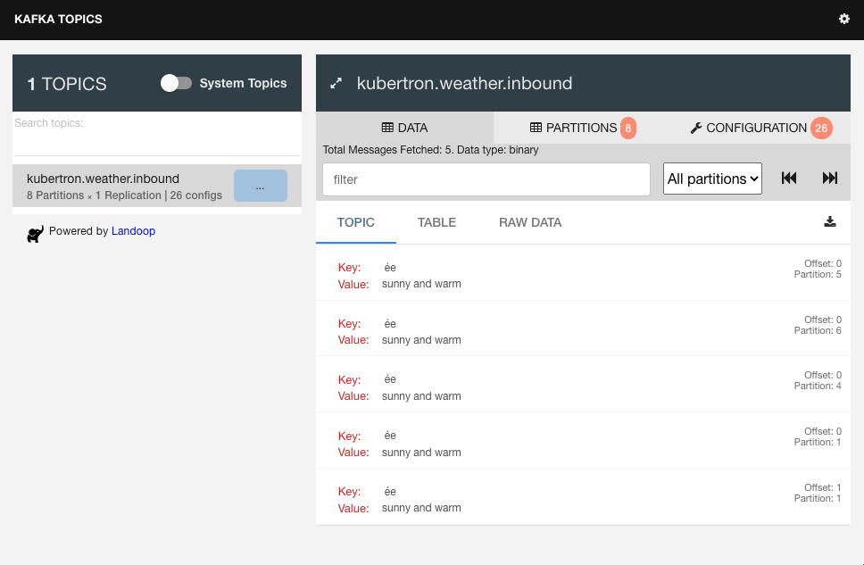

# Writing a Kafka Producer
Let's get started writing a simple weather data producer. This will stream
weather data into Kafka so it can be consumed and processed "downstream". 

## The Boilerplate
In `src` there is already a file called `__init__.py`. This identifies the
directory as a Python "package". Don't worry about the detail right now but
this will help use run the service we are writing later.
  
In `src`, create a file called `producer.py` and add the following code:  

```python
"""Simple Kafka Producer"""
import sys
import time

from termcolor import colored


def main():
    """Main weather sample processing loop."""
    while True:
        try:
            time.sleep(1.0)
        except KeyboardInterrupt:
            print(colored('Shutting Down', 'green'))
            return 0


if __name__ == '__main__':
    sys.exit(main())
```

Here we've imported some packages for a basic app. For pretty output we can
use `termcolor`. We've added a main loop that runs forever, sleeping every
iteration, until we issue a `KeyboardInterrupt` from the command line.

## Make a Kafka producer
We are going to use the [kafka-python](https://pypi.org/project/kafka-python/)
package. Add the following to the top of `producer.py`: 

```python
from kafka import KafkaProducer
```

Before we enter the main processing loop (just before _while True:_),
instantiate a producer:

```python
producer = KafkaProducer(bootstrap_servers='localhost:29092')
```

The `bootstrap_servers` parameter specifies a Kafka broker to connect with. The
Docker Compose set up we have defines a listening port on _localhost:29092_. 

## Send messages 
We are now ready to invoke `producer.send`, the method that sends our data to
a Kafka topic. Add the following lines after the beginning of the `try:` clause: 

```python
producer.send('kubertron.weather.inbound', b'sunny and warm')
print(colored('Sent weather message', 'green'))
```

Here we are specifying the topic _kubertron.weather.inbound_ and a message
body indicating the prevailing weather. Note that the argument value should
be type _bytes_.  

## Running the code 
We are ready to execute our app! In a terminal window, make sure you are in the
`kafka_demo` directory. Enter:

```bash
$ python -m src.producer 
```

You should see output something like:

```bash
Sent weather message
Sent weather message
Sent weather message
Sent weather message
...
```

appearing once a second. Navigate a browser to `http://localhost:8000`, you
will see some of your messages:




Some points to note:

- We didn't specify a key, the `èe` key value represents a null key.
- Our producer client published to various topic partitions.
- When we publish to a partition on a subsequent occasion, the offset
  is incremented.

Excellent work, you've successfully published to Kafka! Enter `ctrl+c` to
terminate the app.

## The story so far
This is great progress! Hopefully you've got a `producer.py` module that
looks a bit like this: 


```python
"""Simple Kafka Producer"""
import sys
import time

from kafka import KafkaProducer

from termcolor import colored


def main():
    """Main weather sample processing loop."""
    producer = KafkaProducer(bootstrap_servers='localhost:29092')
    while True:
        try:
            producer.send('kubertron.weather.inbound', b'sunny and warm')
            time.sleep(1.0)
        except KeyboardInterrupt:
            print(colored('Shutting Down', 'green'))
            return 0


if __name__ == '__main__':
    sys.exit(main())
```

Here's a quick recap of what we have done so far:

- Wrote a Kafka Producer from scratch.
- We ran our producer app.
- We took a look at the Kafka UI and saw our messages.
 
Next we are going to write a simple Kafka Consumer, so we can consume our
Producer's messages.
